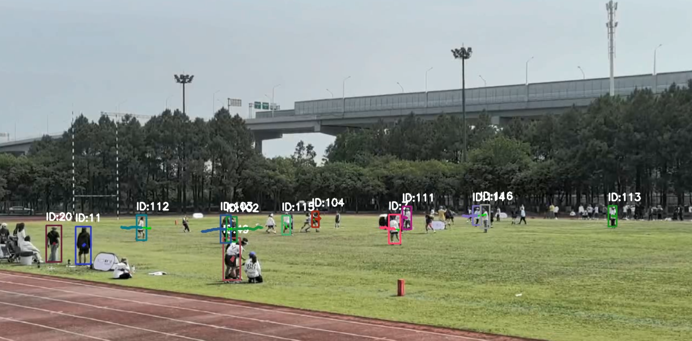

 ---
### student_id: 20413383
### name: Wenhao WU
### module_code: COMP3065
### coursework: 1
### date: 3 May 2025
 ---

# Person Tracking with YOLO11s and Kalman Filter
## 1. Objectives and Key Functionalities

The main objective of this project is to create a real-time person tracking system for video sequences. This system combines a YOLOv11s-based object detector—fine-tuned on the WiderPerson dataset—with a Kalman filter to ensure smooth and accurate tracking over time, predicting the trajectories of bounding boxes. Specifically, the goal is to:

- **Accurate Pedestrian Detection**: The system accurately detects pedestrians in every video frame, achieving high levels of precision and recall. Uses a YOLOv11s model that has been specifically fine-tuned on the WiderPerson dataset to enhance detection performance.
- **Kalman Filter**: Achieve smooth and reliable object tracking with a custom Kalman filter, known as KalmanBoxTracker. This model effectively estimates an object's position $(x, y)$, size (width and height), and velocity $(vx, vy)$ to ensure consistent motion prediction.
- **Data Association**:This system uses the Hungarian algorithm (specifically, linear_sum_assignment) applied to the IOU matrix to optimally match new detections with existing trackers. This approach helps minimize ID switches, manages missed detections effectively, and maintains consistent object identities even when objects are occluded or partially visible.
- **Visualization**: Smooth trajectories and predicted bounding boxes are visualized in the output video, and the trajectory ids output by the detector are used to assign consistent ids to the detected individuals in each frame.
  
## 2. Methodology
### 2.1 YOLO11s Fine-Tuning
- **Dataset**:  WiderPerson is a large-scale pedestrian detection benchmark with images selected from different everyday scenes (beyond traffic scenes) and annotated with pedestrian bounding boxes under various occlusion levels. The dataset was divided into 8000 training sets and 1000 validation sets.
- **Model**: 
    - **backbone**: 
      - The modified C3K2 block has 18% fewer parameters compared to the standard CSPDarknet53.
      - Shallow depthwise separable convolutions preserve spatial details for small pedestrians.
    - **Neck**: 
      - PANet-SPP hybrid architecture combines: (1) Bottom-up path: Transmits high-resolution features (stride=8) (2)Top-down path: Integrates semantic context (stride=32)

      - Adaptive feature fusion weights computed via attention gates.
    - **Head**: Three-scale detection head predicts objectness, class probabilities (pedestrian class only), and bounding‑box regressions at strides of 8, 16, and 32 pixels.
    - **Input Size**: 640×640 pixels by default.
    - **Params & FLOPs**: 9.4M parameters, 21.5 GFLOPs per inference, balancing speed and accuracy.
- **Training**: 
    - **Optimizer**: SGD with learning rate 0.01, momentum 0.9, and weight decay 0.0005.
    - **Batch Size**: 16 per GPU.
    - **Epochs**: 100 total training epochs.
### 2.2 Kalman Filter Design (`KalmanBoxTracker`)
The Kalman filter is a recursive Bayesian estimator designed to optimally fuse noisy measurements and model-predicted states under linear Gaussian assumptions. `KalmanBoxTracker` implements a constant-velocity Kalman filter for 2D bounding-box tracking.
- **State Vector (6-D)**:
    -  `(x, y)`: Center coordinates
    -  `(w, h)`: Bounding-box width and height
    -  `(vx, vy)`: Velocity
  
The 6-dimensional state vector is defined as: 
$$ [x, y, w, h, vx, vy]^T $$
- **Matrix**:
  - **Translation Matrix - F**: 
    ```
        self.KalmanBoxTracker.F = np.array([
            [1,0,0,0,1,0],  # x = x_prev + vx*dt 
            [0,1,0,0,0,1],  # y = y_prev + vy*dt
            [0,0,1,0,0,0],  # w
            [0,0,0,1,0,0],  # h
            [0,0,0,0,1,0],  # vx
            [0,0,0,0,0,1]   # vy
        ])
    ```
    Meaning: Describe how the state changes over time
  - **Observation model - H**: 
    ```
    self.KalmanBoxTracker.H = np.array([
        [1,0,0,0,0,0],  # Observate x
        [0,1,0,0,0,0],  # Observate y
        [0,0,1,0,0,0],  # Observate z
        [0,0,0,1,0,0]   # Observate h
    ])
    ```
    Meaning: Extract observable components from the state vector
  - **Covariance matrix - P**:
    ```
        self.KalmanBoxTracker.P[4:,4:] *= 1000.  
        self.KalmanBoxTracker.P *= 10.            
    ```
  - **Process noise - Q**:
    ```
        self.KalmanBoxTracker.Q = np.eye(6)
        self.KalmanBoxTracker.Q[4:,4:] *= 0.01
    ```
    Meaning: The sources of error in model prediction
  - **Observation noise - R**
    ```
    self.KalmanBoxTracker.R = np.diag([5, 5, 3, 3])
    ```
    Meaning: Uncertainty in state estimation
- **WorkFlow**
  - **Initialize the tracker**: When YOLO detects a new object, the filter is initialized with the initial bounding box.
  - **Predict**: The current position is predicted based on the previous frame state.

      
  - **Update**: The detection result of the current frame is used to correct the prediction.
      
      
    Where:

    $z_k$: Represents the bounding box information of the object detected by YOLO in the current frame.

    $K$: The fusion weight of the predicted value and the observed value is controlled.

    $\hat{x}_k$: The predicted state at the current time.

    $x_k$: Contains optimal estimates of the position, size, and velocity of the target.
### 2.3 Data Association
1. Compute IoU between det_boxes and trk_boxes from predictions.
2. Use Hungarian algorithm (`linear_sum_assignment`) on the negative IOU matrix.
3. Match only pairs with IOU ≥ 0.3.

**FUNCTION**:
- **Identity consistency maintenance**: The detection box of the current frame is matched with the historical trajectory to ensure that the same object maintains a unique ID in different frames. Avoid Identity Switch caused by similar appearance or abrupt movement of the target.

- **Multi-object discrimination**: Distinguishing objects that are close to each other in dense scenes (e.g., individuals in a crowd). Through the joint matching of motion trajectory, the confusion problem when the targets cross is solved.
### 2.4 Tracking Pipeline
1. **Frame**: Read and preprocess each video frame.
2. **Detection & Tracking**: Obtain bounding boxes and track IDs.
3. **Data Association**: Calculate the IoU and use Hungarian algorithm to match objects.
4. **Filter Update**: Create a new KalmanBoxTracker instance for IDs that haven't been seen before. For existing trackers, update their filters with the latest measurements.
5. **Prediction**: Use `kalmanFilter.predict()` to forecast the next bounding box for each active track.
6. **Pruning**: Remove filters for targets missing beyond a threshold.
7. **Visualization**: Draw up to 30-point colored trajectory polylines and predicted boxes, with ID labels.

## 3. Results on Test Videos
### 3.1 Easy Task -- One Object Tracking
My test result


YOLO11s result


On simple tasks, both my fine-tuned model and the original model perform very well.
### 3.2 Medium difficulty Task -- Multiple Objects Tracking with Low Speed
My test result


YOLO11s result


In the medium difficulty, you can see from the figure that in my results, the detection box of ID 6 did not disappear after being occluded by two passer-by, but through motion prediction. After the figure was occluded, the ID did not change, while the original model changed the ID of the same figure (ID 60->ID 225).
### 3.3 Hard difficulty Task -- Multiple Objects Tracking with High Speed
My test result




YOLO11s result


In the difficult difficulty, the recognition performance of the far-point person is relatively general, and the ID switch of the far-point person is more frequent. My fine-tuned model is compared with the original model, because the trajectory prediction algorithm is smoother than the original algorithm, but there is still room for improvement.

## 4. Evaluation 
### 4.1 Strengths
- **Efficient Algorithm**: YOLO11s fine-tuning and optional Kalman filter complement each other to balance speed and smoothness.

- **Modular design**: A clear separation between detection, tracking, and smoothing facilitates scalability.

- **Performance**: Better than the original YOLO11s model
### 4.2 Limitaion
- **Small-scale detection**: high occlusion rates and tiny pedestrian instances still generate false negatives. Future work could integrate super-resolution or attention modules.

- **ID Recovery**: While ID can be recovered, longer occlusions cause mismatches, which can be reduced by incorporating appearance features (Re-ID).

- **Limitations of motion model**: Constant velocity assumption leads to small prediction error at fast acceleration, but prediction results with acceleration are not good, constant acceleration model or changing filter to update acceleration can better capture dynamic motion.
### 4.2 Future Work
- **Appearance Re-identification**: Integrating a deep Re-ID network to handle long-term occlusions and re-entry.

- **Advanced motion models**: Replacing constant velocity Kalman with acceleration filters or incorporating optical flow dynamics.

## 5. Conclusion & Future Work
### 5.1 Conclusion
This project shows that the YOLO11s tracking pipeline enables real-time, accurate pedestrian tracking with minimal implementation complexity. Key achievements include:


- **Strong ID persistence**: under moderate occlusion, the IDswitch rate is lower than the original model through motion trajectory prediction, and the detection box can continue to predict the trajectory of the person after occlusion through the motion model.

- **Clear visualization**: Efficient trajectory overlay for motion analysis.

### 5.2 Future work:

- **Appearance Re-identification**: Integrating a deep re-identification network to handle long-term occlusions and re-entry.

- **Advanced motion models**: Replacing constant velocity Kalman with constant acceleration filters or incorporating optical flow dynamics.